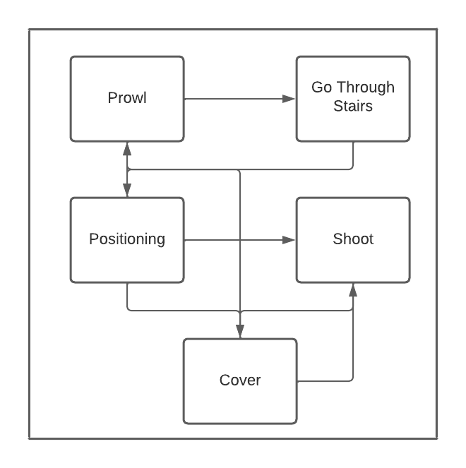
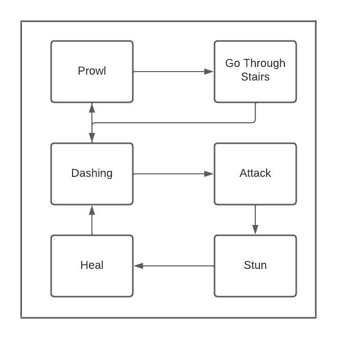
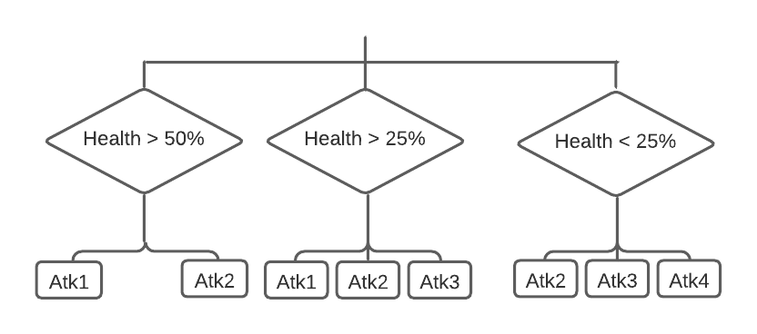

# IAV Proyecto Final - Dungeon Crawler: The Controller
 
## Propuesta
 
Se propone para este proyecto la realización de un **Dungeon Crawler** (al estilo Enter the Gungeon) **controlado de manera automática**, e implementando distintos agentes inteligentes.
 
Para ello, se dividirá el trabajo en varias secciones:
 
- **Creación aleatoria con memoria del mapa** (*Daniel Illanes Morillas*): Se creará un mapa de juego estilo roguelike de manera pseudo-aleatoria, siguiendo una serie de reglas predefinidas básicas. Además, la “dificultad” del mapa se ajustará al nivel del jugador, equilibrando las recompensas y castigos en función del desempeño del jugador.
 
- **Enemigos, Jefe Final y "Game Master"** (*Aarón Nauzet Moreno Sosa*): Habrá distintos agentes inteligentes en el mapa, cada uno de ellos con su máquina de estados, que intentarán entorpecer al jugador. Se destaca el jefe final, con un árbol de comportamiento; y el "game master", un agente que intentará entorpecer al jugador.
 
- **Controlador automático del jugador** (*Sergio José Alfonso Rojas*): Habrá un agente inteligente que tratará de pasarse el juego de forma automática. Llevará esto a cabo teniendo en cuenta la situación del mapa (zonas inexploradas, distancia a zonas útiles o peligrosas, etc), el equipamiento (comenzará con un arma sencilla y podrá encontrar armas mejores en cofres del escenario) y parámetros como la vida, la armadura o la munición actual (buscará consumibles que recompongan estos parámetros antes de afrontar batallas difíciles). Asimismo, contará con un set de movimientos equivalente al juego de referencia, destacando éste por utilizar un una evasión que evita el daño de contacto de los proyectiles enemigos.
 
## Planteamiento Inicial

Habrá una serie de agentes inteligentes cuya misión principal es entorpecer al jugador y hacerle perder la partida. Estos agentes se dividen en **tres grupos principales**, según su función en el juego, y su controlador interno.

- **Basic Enemies:** Estos agentes estarán esparcidos por las distintas salas de la mazmorra, siendo controlados por una IA basada en una **maquina de estados**. Podemos distinguir entre dos tipos:

    - **Ranged:** El enemigo a rango se encargará de disparar al jugador, manteniendo la distancia y pillando cobertura cuando sea necesario.  
      
        *Pseudo-máquina de estados:*
        

    - **Melee:** El enemigo a melé se acercara el jugador, corriendo hacia él, haciendo todo el daño posible.

        *Pseudo-máquina de estados:*
        

- **Dungeon Final Boss**: Este agente es el principal enemigo del controlador del jugador, pues su muerte equivaldrá a la victoria de este último. Este será controlado por un **árbol de comportamiento**, que se adaptará a las fases del combate.

    *Pseudo-árbol de comportamiento*:
    

- **Enemy Game Master**: Como toque final, habrá un agente inteligente que, de manera *"omnipotente"*, se encargará de **modificar el mapa para favorecer a los enemigos**, ya sea con trampas, generadores de enemigos base, o escaleras que conecten salas entre ellas.

    Para ello, se aplicará un **mapa de influencia** que permita conocer la presencia de tanto enemigos como jugador en la mazmorra, y así seleccionar de manera acorde.